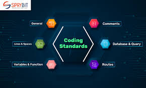

## What is ESLint? 
ESLint is a grammar checker extension in Visual Studio code for proper and neat typescript organization. Basically a structure checker for proper coding etiquette. 

## What makes coding standards so important?
Although some people may disagree, however I believe that for shared and organized projects with other collaborators, it is much essential for lines of code to be legible and easy to interpret. Without an universal coding standard, different collaborators may have different interpretation of lining up code and thus create a chaotic environment in which neither side can easily interpret each other's code. Thus why it is very important, for the sake of personal and your peer's quality of life, for there to a standard agreed upon when working on a project together. 

## My experience with ESLint 
ESLint reminded me a lot of checkstyle, which is also a coding standard implementation, however for Java on the Eclipse IDE. What made ESLint a lot more useful and easy to use was the "quick fix" function it provided when the format doesnt match the requirements. There were options to solve the format problem individually or quickfix everything that it can take care on its own. ESLint was also a lot easier to follow as it provided multiple solutions, including a way to ignore the ESLint warning itself. I think it is useful for github repositories as my projects would be shared to the TAs and my fellow classmates to view and share opinions on. 
