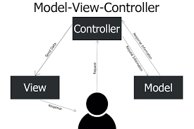

# Introduction 

As LLMs like ChatGPT and Co-Pilot evolve, becoming more prominent and accessible, the nature of education has shifted drastically. When it comes to software engineering, an average AI language model is on par to that of a software engineer with 10 years of experience, and with drastically faster speeds and processing time. More and more students are now utilizing AI to help develop websites and code for them, and use it to learn as it is a quick and easy resource to access. Personally in 314, I have utilized AI in assistance for coding, debugging, and learning/understanding a topic. The most common AI tools I have used include ChatGPT, Claude, along with Co-Pilot.

# Honest AI Usage

Throughout ICS 314, I used AI as a major support tool across almost every assignment, practice activity, and understanding of concepts. The course moved quickly and introduced multiple concepts like TypeScript, React, Next.js, CSS, and ESLint, and I had to utilize AI to accelerate my understanding and clarify errors in my code. Furthermore, AI was used to break down unfamiliar topics and give examples on how to utilize extensions of the tools we use in the class. Below is a detailed explanation of how I utilized AI across ICS314.

## Experience WODs

I used AI extensively while checking for any errors throughout my Experience WODs. I would first practice the experience WOD completely on my own, then watch the answer videos to check my answer, and then utilize AI to consistently check for my mistakes while I'm on my next attempt.  

## In-class Practice WODs

For the practice WODs, I frequently used AI both during and after the exercises. I utilized AI to correct my syntax and any ESLint errors I might have. After the class exercises are over, if I hadn't finished or my WOD code is not functional, I would use AI to review my work and guide me through the correction of my code. 

## In-class WODs

In the in-class WODs, I would rely on AI to correct any mistakes that may occur after an error pops up. I would first attempt to solve the WOD on my own, but when I run into an error and I can't find a solution or have missed a few key details, I would use AI to scan through my code and look for the errors and offer solutions. 

## Essays 

For my essays in the GitHub portfolio, I would only use AI to enhance my writing through grammar correction and correction of any incoherent paragraphs that don't align. I would also ask AI for formatting suggestions to make my essays neat and organized.

## Final Project

AI was one of the many tools I used during the final project. One example being asking AI to explain ESLint errors and typescript errors, along with database troubleshooting in Prisma. Another was to use AI for suggestions and ideas on the approach to the final project, and what elements to utilize to make the UI more user friendly. One example of that would be the star button on the review page for the app, and the text box formatting and button. 

## Learning a Concept/Tutorials 

This is where I used AI the most. When paragraphs of text overwhelm me, I tend to rely on AI to simplify the instructions and break them down step by step for easier understanding. Sometimes the formatting of TypeScript would also throw me off because of my familiarity with other programming languages like C; therefore, many times I would ask AI for correct syntax rules of TypeScript.

## Answering a Question in Class or Discord

I never really used AI to answer questions in class or discord, because I felt that if I am not 110% familiar with the topic, I shouldn't try to teach and pretend I can. I believe that teaching a subject requires understanding beyond the basics, and if I rely on AI to produce an answer then I shouldn't be answering questions in the first place. 

## Asking or Answering a Smart-Question

Like previously mentioned, I wouldn't want to teach and pretend I understand a subject if I rely on AI, therefore all my questions and answers aren't AI backed. 

## Coding Examples

I often use AI to generate code snippets after practice WODs to make sure I fully understand the concept. I often generate the snippet and trace through the code with AI to solidify the concept. 

## Writing Code

I often used AI to help draft or refine code, like asking for suggested approaches, or fixing logic issues. However even while writing the code I would always use AI's explanation to help myself review, edit, and rewrite the code rather than a copy paste.

## Documenting Code

AI helped me write clearer comments and documentation. Often I would ask it to generate headers that would look coherent and be understanding of a potential viewer for my code. It would provide documenting paragraphs that clarified a function's purpose and even rephrase my drafted explanations. 

## Quality Assurance

AI was extremely helpful for debugging, and I utilized it to:

- Identify TypeScript or ESLint errors
- Explain React warnings
- Point out logical flaws in my code
- Suggest fixes for API and Prisma database issues

## Other Uses

- Summarize long texts
- Generate similar practice WODs for extra practice
- Understand design patterns and different approaches to a solution