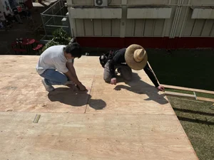

This 12x12' replica bedroom, dedicated to the Special Education department, serves as a space for students to foster a sense of independence and practical life. From changing bed sheets to mastering household chores, this shack will provide students with hands-on exposure to housekeeping tasks. Not only does the shack empower Special Education students, but it's also a hands-on classroom for our engineering students. They'll be able to have the experience of constructing a larger scaled structure, using their skills for real-world application. In this project, students volunteers like me were able to practice real life carpentry skills, along with critical problem solving skills 

You can learn more at the [AOK Foundation's page](https://www.iamevanknight.com/things-i-made/kalani3).
